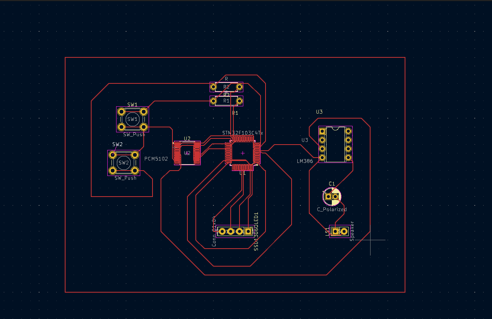
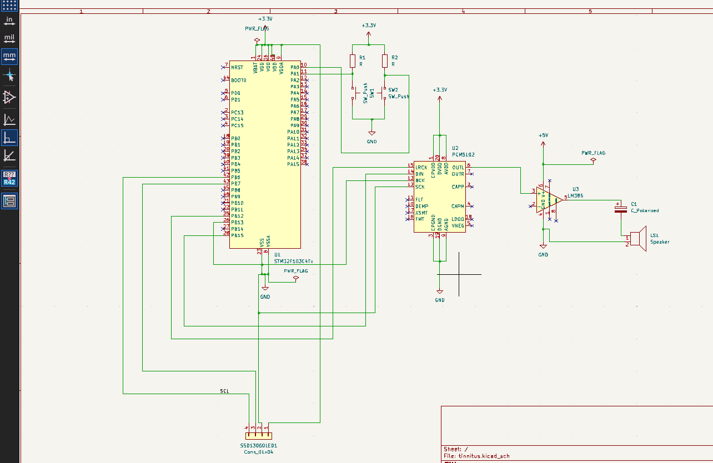
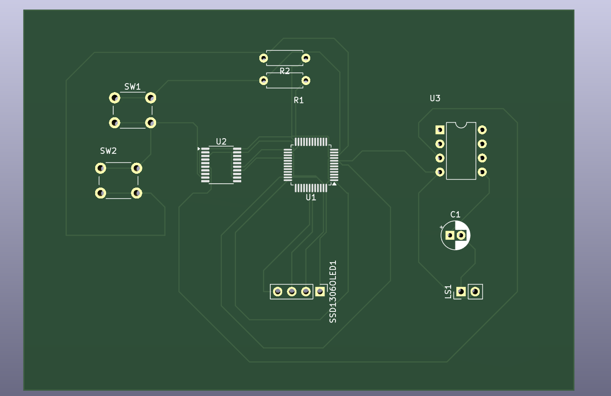

# Tinnitus Masking Device

## Overview
This project presents the design and implementation of a PCB-based tinnitus masking device aimed at providing sound therapy for individuals experiencing tinnitus. The system generates controlled audio signals to reduce the perception of ringing in the ears.

## Features
- Compact and portable PCB design  
- Audio signal generation for tinnitus masking  
- Low-power operation  
- Simple and efficient circuit architecture  

## Hardware Design
The circuit was designed using KiCad, including schematic capture and PCB layout. The design ensures reliable signal generation and efficient power usage.

## Design Files
- Schematic (`.kicad_sch`)
- PCB Layout (`.kicad_pcb`)
- Project File (`.kicad_pro`)

## Images

### PCB Layout

### Schematic

### 3D View

## Applications
- Tinnitus sound therapy  
- Assistive biomedical devices  
- Low-cost healthcare electronics  

## Future Improvements
- Adjustable frequency range  
- Integration with microcontroller for adaptive control  
- Miniaturization for wearable applications  

## Author
Akshatha Pai
